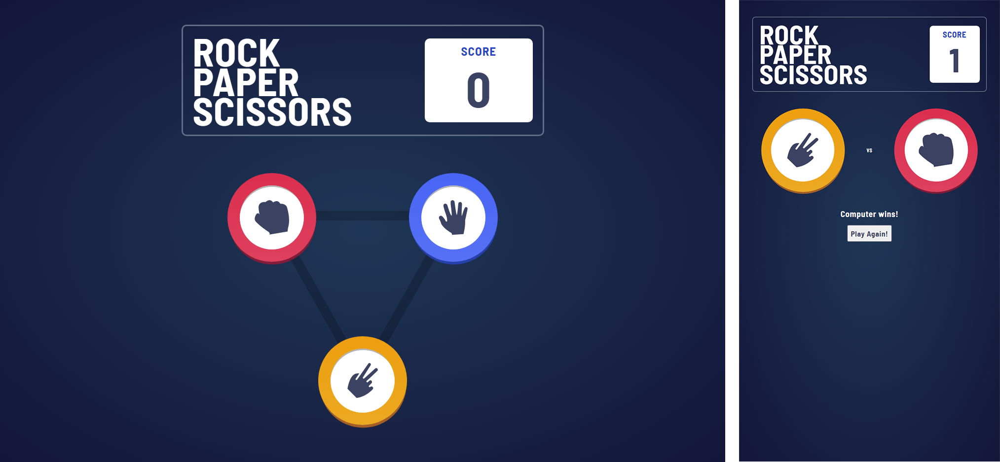

# Rock Paper Scissors

This is a simple Rock Paper Scissors game built with React with assets from FrontendMentor.io. It allows users to play the classic game against the computer and keep track of their score.

## Features

- Play against the computer in a game of Rock Paper Scissors
- Interactive user interface
- Real-time score tracking
- Random computer selections
- Fully responsive

## Technologies Used

- React - JavaScript library for building user interfaces.
- HTML/CSS - Markup and styling of the game.
- JavaScript - Programming language for game logic.

